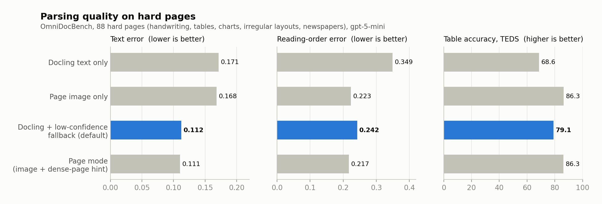
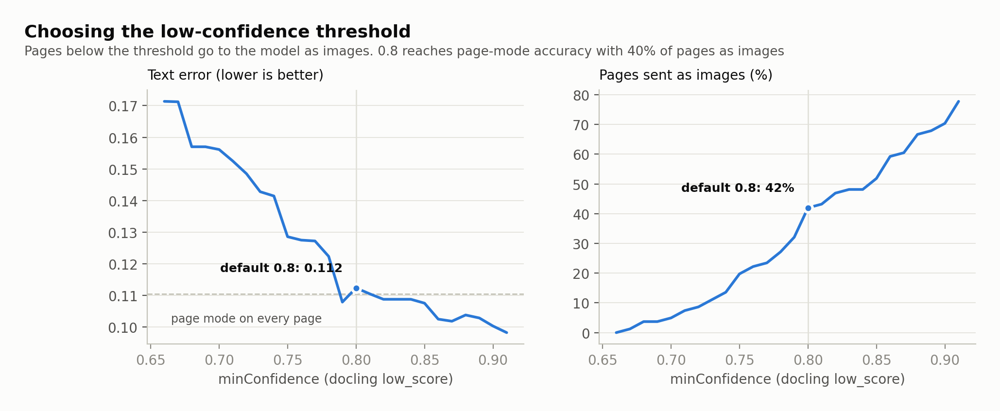

# docling-serve for LLMs (ctxwise fork)

[docling-serve](https://github.com/docling-project/docling-serve) with one addition: an endpoint that returns a
converted document as **LLM-ready parts** - compact text plus only the images worth sending to a vision model.
It is the server behind [`@ctxwise/ai-sdk-docling`](https://github.com/ctxwise/ai-sdk-docling). The server itself
never calls an LLM.

Everything upstream offers is unchanged. The fork adds:

| Change | Where |
|---|---|
| `POST /v1/convert/file/parts` | `docling_serve/app.py` (one endpoint), `docling_serve/parts/` |
| Per-page confidence on conversion results | `docling_serve/parts/confidence.py` |
| LibreOffice, for `.doc`, `.xls`, `.ppt`, `.rtf` | `os-packages.txt` |
| `DOCLING_SERVE_SYNC_POLL_INTERVAL` accepts fractions of a second | `docling_serve/settings.py` |
| Deployment, benchmarks and this guide | `ctxwise/` |

## Run

```bash
cp ctxwise/.env.example ctxwise/.env      # then set DOCLING_API_KEY (openssl rand -hex 24)
docker compose -f ctxwise/docker-compose.yml up -d
```

The server listens on `127.0.0.1:5001` (use this address rather than `localhost`: on Windows `localhost` tries IPv6 first and each request waits about 2 s) and requires the API key in the `x-api-key` header.

## API: `POST /v1/convert/file/parts`

One request converts one file and returns its parts. The upload is the same multipart form as upstream's
`/v1/convert/file` (any docling option can be sent as a form field); routing options go in the query string.

```bash
curl -s -X POST "http://127.0.0.1:5001/v1/convert/file/parts?min_confidence=0.8" \
  -H "x-api-key: $DOCLING_API_KEY" -F "files=@scan.pdf" -F "ocr_preset=rapidocr"
```

```json
{
  "filename": "scan.pdf",
  "confidence": 0.78,
  "page_confidence": { "1": 0.78, "2": 0.93 },
  "processing_time": 14.9,
  "parts": [
    { "type": "text", "text": "[page 1, confidence 0.78]" },
    { "type": "image", "media_type": "image/jpeg", "data": "<base64>", "page": 1 },
    { "type": "text", "text": "[page 2, confidence 0.93]\n## Alan Turing\n..." },
    { "type": "image", "media_type": "image/png", "data": "<base64>", "picture_class": "photograph" }
  ]
}
```

| Part | Meaning |
|---|---|
| `text` | Markdown: headings, lists, tables with merged headers, `[slide N]`, `## Sheet: name`, speaker notes, picture captions and the text inside charts |
| `image` | a picture (with its `picture_class`) or a whole-page render (with its `page`, sent as JPEG at most 1568 px) |
| `source` | send the original file here: docling read it unreliably, and the model reads the original better |

| Query option | Default | |
|---|---|---|
| `mode` | `docling` | `docling`: text and pictures, low-confidence pages as images. `pages`: every page as an image |
| `min_confidence` | `0.8` | pages below this docling confidence go as images; `0` = never |
| `source_readable` | `true` | the client's model reads the original file, so a `source` part may replace page renders |
| `max_pages` | `100` | pages converted; the text says when a document was cut |
| `max_page_images` | `20` | page images per document; later pages go as text |
| `dense_chars` | `3000` | page mode: pages with more text also get docling's text |
| `max_images` | `10` | pictures per document; charts, diagrams and tables first, photos last |
| `skip_classes` | `logo`, `icon` | picture classes never sent (repeat the parameter) |
| `min_image_px` | `48` | smaller pictures are dropped |
| `picture_text_chars` | `600` | text read inside a chart or diagram, sent next to it; `0` = off |

## Deployment

CPU only; no GPU needed. Size workers x threads to the machine's vCPUs with `DOCLING_WORKERS` and `DOCLING_THREADS`:

| Server | Workers x threads | Speed (measured) | Memory, idle / peak (measured) |
|---|---|---|---|
| 4 vCPU / 16 GB | 2 x 2 (default) | ~7 s per page, 2 documents in parallel | 0.8 GB / 3.6 GB |
| 2 vCPU / 8 GB | 1 x 2 | ~10 s per page, 1 document at a time | 0.8 GB / 2.7 GB |


**Scaling out.** Each request carries the whole conversion, so any container can serve any request: put several
behind a plain load balancer (no sticky sessions, no shared storage) and autoscale on CPU (about 70%). Keep at least
two warm containers - a new one needs one to two minutes to pull the image and load the models.

**Timeouts.** A request stays open while its document converts: seconds for most files, up to about 12 minutes for
100 pages. Keep the server internal (app to docling in the same network) and set every hop to about 20 minutes:
`DOCLING_SERVE_MAX_SYNC_WAIT` (set in `docker-compose.yml`), the load balancer's idle timeout (AWS ALB: up to 4000 s)
and the client's timeout. Don't put it behind API Gateway (29 s hard limit) or Cloudflare (100 s).

**Health checks.** Status requests slow down while a conversion is running; give health checks a timeout of about
10 s so busy containers aren't replaced.

**Full queue.** Each container rejects work once `DOCLING_SERVE_QUEUE_MAX_SIZE` is reached; the client retries, and
the load balancer sends the retry to another container.

**Avoid burstable CPU for steady traffic.** Sustained conversion drains CPU credits, after which a burstable
instance runs at a fraction of its vCPUs.

**When one request per document is no longer enough** (jobs that must survive restarts, long bursts of queued
work): upstream's Redis queue orchestrator separates API and workers. Per-page confidence then falls back to the
document score, because Redis serializes results.

**Security.** API key required, port bound to localhost, no outbound calls (`DOCLING_SERVE_ENABLE_REMOTE_SERVICES`
off), and caps on file size, pages, time and queue length.

## Quality

88 hard OmniDocBench pages (handwriting, tables, charts, irregular layouts, newspapers), read by `gpt-5-mini`.
Full comparison with docling alone, PyMuPDF4LLM and MarkItDown: [docs/COMPARISON.md](docs/COMPARISON.md).




Neither source wins everywhere - docling is best on clean and dense print, vision on handwriting and layouts.
Routing by confidence takes the better one per page.


<details>
<summary>How the thresholds were chosen</summary>



Docling's `low_score` ranged 0.67-0.96 on these pages; all pages where docling failed scored 0.85 or lower.
At 0.8, 40% of hard pages go to the model as images - clean documents score higher and stay text.


In page mode, docling's text is added next to the image only on dense pages without tables. Anywhere between
2,500 and 6,000 characters gives the same result.

</details>

Benchmarks and how to reproduce them: [bench/README.md](bench/README.md).

## Development

```bash
docker build -f ctxwise/dev.Dockerfile -t docling-serve:dev .   # the release image plus this fork's Python
DOCLING_IMAGE=docling-serve:dev docker compose -f ctxwise/docker-compose.yml up -d
PYTHONPATH=. uvx --with pytest pytest tests/parts                # parts: identical to the reference output
```

Changes stay small and in their own files so upstream releases merge cleanly: rebase `main` onto a new upstream
tag (`git fetch upstream --tags && git rebase <tag>`), run the tests, and bump `DOCLING_VERSION`.

### Releases

Tag `main` as `v<upstream-version>-ctxwise.<n>` and push the tag (`git tag v1.35.0-ctxwise.1 && git push origin v1.35.0-ctxwise.1`).
[`.github/workflows/ctxwise-image.yml`](../.github/workflows/ctxwise-image.yml) builds the CPU image (linux/amd64) and publishes
`ghcr.io/ctxwise/docling-serve:<tag>` and `:latest`. The package README's `docker run ... ghcr.io/ctxwise/docling-serve:latest`
pulls this image. A manual run (Actions > ctxwise image > Run workflow) publishes only `:sha-<short>`.
