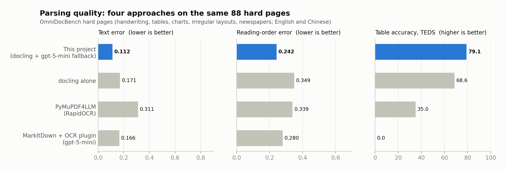
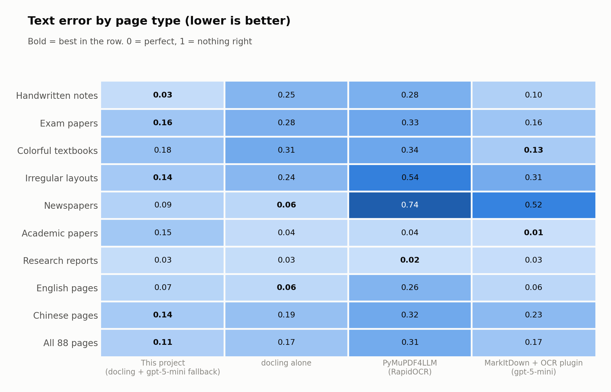
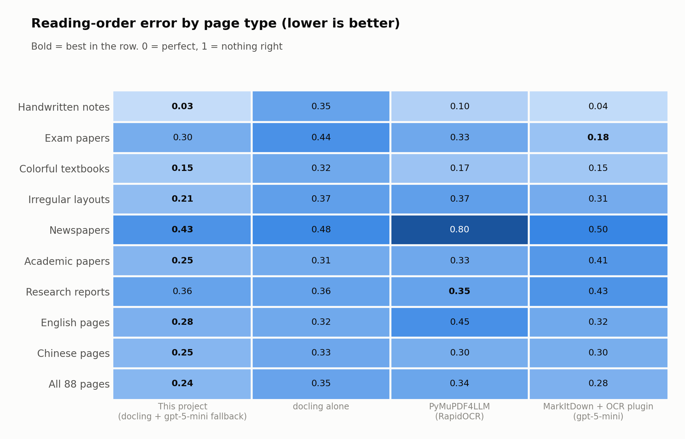
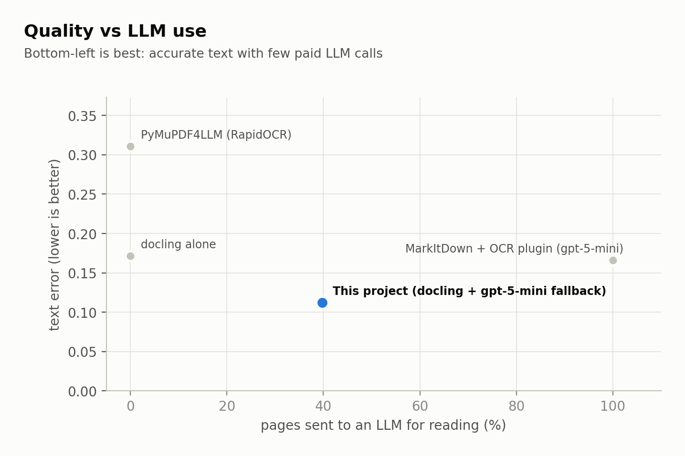
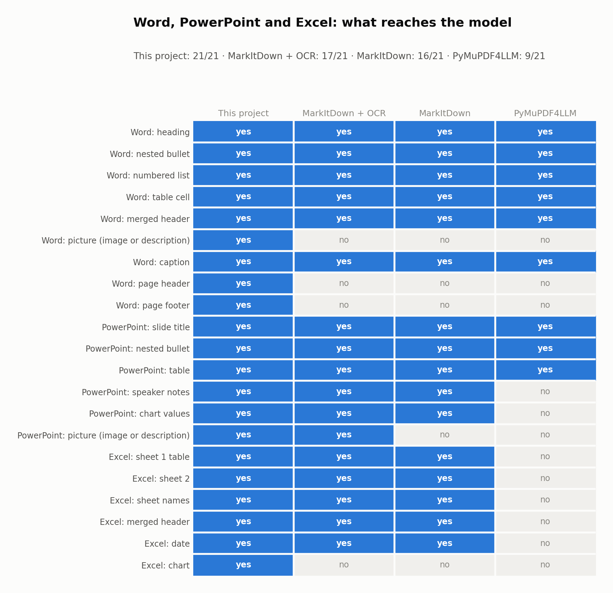

# Parser comparison

How this project compares with docling alone, [PyMuPDF4LLM](https://github.com/pymupdf/pymupdf4llm) and
[MarkItDown](https://github.com/microsoft/markitdown) (with its OCR plugin), measured on the same documents.

## Summary

| | This project | docling alone | PyMuPDF4LLM | MarkItDown + OCR plugin |
|---|---|---|---|---|
| Hard pages: text error (lower is better) | **0.112** | 0.171 | 0.311 | 0.166 |
| Hard pages: reading-order error (lower) | **0.242** | 0.349 | 0.339 | 0.280 |
| Hard pages: table accuracy, TEDS (higher) | **79.1** | 68.6 | 35.0 | 0.0 |
| Hard pages sent to an LLM | 40% | 0% | 0% | 100% |
| Word / PowerPoint / Excel checks (21) | **21** | - | 9 | 17 |
| Digital 9-page PDF, 4 vCPU | 64 s | 64 s | 28 s | 185 s (26 LLM calls) |
| Confidence score, picture types | yes | yes | no | no |
| Legacy DOC / XLS / PPT | yes | yes | no | no |
| License | MIT | MIT | AGPL | MIT |

- **This project** is the most accurate on hard pages and the only one that keeps every Office element, while
  sending only the pages docling can't read reliably to an LLM.
- **MarkItDown + OCR plugin** reads text about as well as docling, but sends every scanned page to an LLM, writes
  tables as spaced plain text (0 table score), and was the slowest on a normal digital PDF.
- **PyMuPDF4LLM** is the fastest on clean digital PDFs, but its layout and tables fall behind even with the same
  OCR engine as docling, and it barely reads Excel.

## What was compared

| | Version and settings |
|---|---|
| This project | docling-serve v1.35.0 (RapidOCR) + per-page confidence routing; pages below 0.8 read by `gpt-5-mini` |
| docling alone | the same docling-serve output, no LLM |
| PyMuPDF4LLM | 1.28.2 with **RapidOCR** (the same OCR engine as docling). With its default Tesseract (English only) it scored 0.790 |
| MarkItDown + OCR plugin | markitdown 0.1.8 + markitdown-ocr 0.1.1 with `gpt-5-mini` (the plugin renders scanned pages at 300 DPI and sends each to the LLM) |

## Hard pages (OmniDocBench)

88 hard pages from [OmniDocBench](https://github.com/opendatalab/OmniDocBench) v1.6 - handwriting, exam papers,
textbooks, newspapers, irregular layouts, tables and charts, in English and Chinese - scored with its official
evaluator. Every method read the same page images.

- **Handwriting:** routing the page to vision gives 0.03 against 0.25 for docling's OCR.
- **Newspapers (dense small print):** vision alone fails (0.52); docling reads them well (0.06), and the dense-page
  hint keeps this project close (0.09).
- **Academic papers - a weakness of this project:** docling alone scores 0.04, this project 0.15. Some of these
  pages score just under 0.8, go to vision, and `gpt-5-mini` reads them worse than docling did.

## Word, PowerPoint and Excel

21 checks on a Word document (lists, merged header, picture, caption, page header/footer), a 5-slide deck
(nested bullets, table, bar chart, photo, speaker notes) and a 2-sheet workbook (merged header, date, chart).

- MarkItDown keeps speaker notes and PowerPoint chart data, but drops the Word picture and page header/footer and
  the Excel chart. Its OCR plugin adds an LLM-written description of the PowerPoint photo.
- PyMuPDF4LLM reads Word and PowerPoint text, but almost nothing from Excel.

## Speed and cost

| | Digital 9-page PDF | Scanned page | LLM tokens |
|---|---|---|---|
| This project | 64 s | ~7 s (+ one LLM call only if confidence < 0.8) | only for low-confidence pages (40% of hard pages) |
| docling alone | 64 s | ~7 s | none |
| PyMuPDF4LLM | 28 s | ~79 s with RapidOCR (4 pages in parallel on 4 vCPU) | none |
| MarkItDown | 3 s (words run together) | nothing (no OCR) | none |
| MarkItDown + OCR plugin | 185 s, 26 LLM calls | ~18 s, 1 LLM call per page | ~3,600 in + 2,200 out per scanned page |

Measured with the container limited to 4 vCPU / 16 GB, median of repeated runs where noted.

## Notes on fairness

- The OmniDocBench items are single pages, so this project's per-page routing and document-level routing make
  the same decisions here. Multi-page documents were only tested on hand-made files.
- MarkItDown's 0 table score comes from its OCR plugin's default prompt, which asks for plain text; a custom
  `llm_prompt` asking for Markdown tables would likely raise it (the same model scores 85.5 when asked for tables).
- PyMuPDF4LLM was run with RapidOCR so that the OCR engine matches docling; the remaining gap is layout and tables.
- All LLM reading used `gpt-5-mini`. A weaker vision model makes results worse: `gpt-5-nano` measured 0.503 text
  error reading these pages.
- Every number here can be reproduced with the scripts in [bench/](../bench/README.md).
